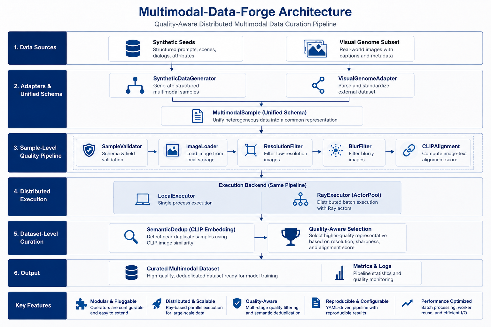
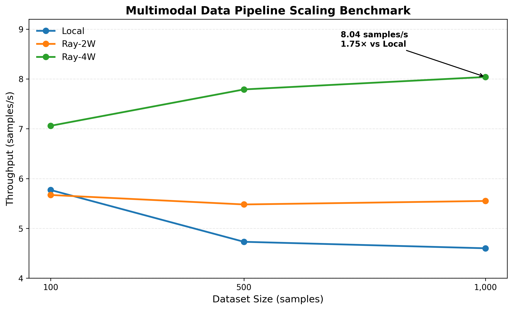

**\# Multimodal-Data-Forge**

**\*\*A quality-aware distributed multimodal data curation and
auto-annotation pipeline for multimodal training datasets.\*\***

Multimodal-Data-Forge is a modular data infrastructure project for
cleaning, filtering, validating, deduplicating, annotating, and serving
image-text data before multimodal model training.

It provides a unified multimodal schema, pluggable quality operators,
interchangeable Local/Ray execution backends, CLIP-based image-text
alignment, quality-aware semantic deduplication, VLM batch
auto-annotation, and a Ray Serve HTTP inference endpoint.

The pipeline has been evaluated on a real-world **\*\*Visual
Genome\*\*** image-text subset with reproducible scaling benchmarks
across Local and Ray execution modes.

------------------------------------------------------------------------

**\## Highlights**

\- **\*\*Unified multimodal schema\*\*** --- normalize heterogeneous
data sources into a common \`MultimodalSample\` representation.

\- **\*\*Pluggable quality pipeline\*\*** --- compose validation,
resolution, blur, and semantic alignment operators through
configuration.

\- **\*\*Distributed execution\*\*** --- switch between
\`LocalExecutor\` and Ray ActorPool workers without changing operator
logic.

\- **\*\*Cross-modal quality filtering\*\*** --- use CLIP similarity to
detect weak image-text alignment.

\- **\*\*Dataset-level semantic deduplication\*\*** --- detect
near-duplicate images using normalized CLIP embeddings and cosine
similarity.

\- **\*\*Quality-aware representative selection\*\*** --- retain the
higher-quality duplicate candidate based on resolution, sharpness, and
image-text alignment.

\- **\*\*VLM batch auto-annotation\*\*** --- generate image captions for
curated samples using BLIP batch inference.

\- **\*\*Configurable annotation stage\*\*** --- enable, disable, and
configure VLM annotation directly through YAML.

\- **\*\*Ray Serve inference API\*\*** --- expose the VLM annotator
through an HTTP endpoint for online annotation.

\- **\*\*Measured scaling\*\*** --- Ray-4W reached **\*\*8.04 samples/s
vs 4.60 samples/s locally (1.75×)\*\*** on the 1,000-sample benchmark.

\- **\*\*Tested core logic\*\*** --- lightweight unit tests cover
validation, filtering, rejection behavior, and quality-aware scoring.

------------------------------------------------------------------------

**\## Architecture**

\<p align="center"\>

  \

\</p\>

The architecture separates **\*\*sample-level parallel processing\*\***,
**\*\*dataset-level global curation\*\***, and **\*\*downstream VLM
annotation/serving\*\***.

\`\`\`text

Visual Genome │ ▼ VisualGenomeAdapter

      │                                      │

      └──────────────────┬───────────────────┘

                         ▼

                 MultimodalSample

                   Unified Schema

                         │

                         ▼

             Sample-Level Quality Pipeline

                         │

             ┌───────────┼───────────┐

             │           │           │

         Validation  Image Quality  CLIP Alignment

             │           │           │

             └───────────┼───────────┘

                         ▼

                 Execution Backend

                   ┌───────────┐

                   │           │

                 Local        Ray

                           ActorPool

                   │           │

                   └─────┬─────┘

                         ▼

                Dataset-Level Curation

                         │

                   Semantic Dedup

                         │

                Quality-Aware Selection

                         │

                         ▼

                   Curated Samples

                         │

                         ▼

                    VLM Annotator

                    /           \\

                   /             \\

                  ▼               ▼

          Offline Batch       Ray Serve API

                                 /

                                /

                    ▼           ▼

              Structured Annotations

                         │

                         ▼

                Dataset / API Output

\`\`\`

This separation allows independent samples to be processed in parallel
while operations requiring a global dataset view, such as semantic
deduplication, are performed after sample-level filtering.

The same VLM annotation logic is reused by both offline batch processing
and online Ray Serve inference.

------------------------------------------------------------------------

**\## Data Pipeline**

The sample-level processing chain is:

\`\`\`text

SampleValidator

      ↓

ImageLoader

      ↓

ResolutionFilter

      ↓

BlurFilter

      ↓

CLIPAlignmentOperator

\`\`\`

After sample-level filtering:

\`\`\`text

Accepted Samples

      ↓

SemanticDedup

      ↓

Quality-Aware Selection

      ↓

Curated Samples

      ↓

Optional VLM Auto-Annotation

\`\`\`

**\### 1. Sample Validation**

\`SampleValidator\` checks the minimum fields required by downstream
multimodal processing, including sample identity, image path, and
image-text description.

Invalid samples are rejected before expensive image or model operations
are executed.

**\### 2. Image Loading**

\`ImageLoader\` resolves image paths, verifies that image assets are
readable, and extracts image dimensions.

**\### 3. Resolution Filtering**

\`ResolutionFilter\` removes images below configurable width and height
thresholds.

Example:

\`\`\`yaml

\- name: resolution_filter

  enabled: true

  params:

    min_width: 512

    min_height: 512

\`\`\`

**\### 4. Blur Filtering**

\`BlurFilter\` evaluates image sharpness and rejects low-quality blurred
samples according to a configurable threshold.

**\### 5. CLIP Image-Text Alignment**

\`CLIPAlignmentOperator\` computes image-text semantic similarity using
CLIP.

Samples with weak cross-modal alignment are rejected before
dataset-level curation.

\`\`\`text

Image ──────► CLIP Image Encoder ──┐

                                   ├──► Similarity Score

Text ───────► CLIP Text Encoder ───┘

                                   │

                                   ▼

                              Accept / Reject

\`\`\`

------------------------------------------------------------------------

\*\*## Visual Genome Data Ingestion

The current project uses a real-world **Visual Genome** image-text
subset as its data source.

Dataset-specific parsing is isolated in `VisualGenomeAdapter`, which
converts Visual Genome metadata into the unified `MultimodalSample`
schema used by all downstream operators.

``` text
Visual Genome Metadata
        ↓
VisualGenomeAdapter
        ↓
MultimodalSample
        ↓
Sample-Level Quality Pipeline
```

This keeps source parsing independent from quality operators and
execution backends while keeping the repository focused on a real
multimodal dataset.

------------------------------------------------------------------------

## Distributed Execution\*\*

The pipeline exposes a common executor interface:

\`\`\`text

Executor

├── LocalExecutor

└── RayExecutor

\`\`\`

**\### LocalExecutor**

\`LocalExecutor\` processes samples sequentially using a local
\`QualityPipeline\`.

It provides a simple execution baseline and is useful for development
and correctness validation.

**\### RayExecutor**

\`RayExecutor\` distributes batches across persistent Ray actors.

\`\`\`text

Input Samples

      ↓

Batch Partitioning

      ↓

Ray ActorPool

 ┌────┼────┬────┐

 ▼    ▼    ▼    ▼

W1   W2   W3   W4

 │    │    │    │

QualityPipeline

 │    │    │    │

 └────┴────┴────┘

      ↓

Merged Results

\`\`\`

Each worker owns its \`QualityPipeline\`, allowing expensive model
initialization to be reused across batches rather than recreated for
every sample.

The executor configuration can be changed without modifying the operator
chain.

\`\`\`yaml

executor:

  type: ray

  num_workers: 4

  batch_size: 2

\`\`\`

or:

\`\`\`yaml

executor:

  type: local

\`\`\`

------------------------------------------------------------------------

**\## Quality-Aware Semantic Deduplication**

Sample-level filtering removes individually low-quality samples, but it
cannot detect redundancy across the complete dataset.

Multimodal-Data-Forge therefore performs semantic deduplication as a
**\*\*dataset-level curation stage\*\*** after the quality pipeline.

**\### Near-Duplicate Detection**

Accepted images are encoded using CLIP image embeddings.

The embeddings are L2-normalized and compared using cosine similarity.

\`\`\`text

Accepted Samples

      ↓

CLIP Image Embeddings

      ↓

L2 Normalization

      ↓

Cosine Similarity

      ↓

Near-Duplicate Detection

\`\`\`

The current implementation uses a conservative similarity threshold:

\`\`\`text

cosine_similarity \>= 0.95

\`\`\`

Samples above the threshold are treated as near-duplicate candidates.

\> The current deduplication implementation is a correctness-oriented
prototype and computes pairwise similarity directly. Approximate
nearest-neighbor indexing is not currently used.

------------------------------------------------------------------------

**\## Quality-Aware Representative Selection**

A basic deduplication strategy can simply retain the first observed
sample in a duplicate group.

However, the first sample is not necessarily the best training sample.

Multimodal-Data-Forge therefore applies a heuristic quality-aware
representative selection strategy.

For each duplicate candidate, the pipeline considers:

\- **\*\*Resolution\*\***

\- **\*\*Sharpness\*\***

\- **\*\*Image-text alignment\*\***

The quality score is defined as:

\`\`\`text

Quality Score =

    0.2 × Resolution Score

  + 0.3 × Sharpness Score

  + 0.5 × Alignment Score

\`\`\`

The weights are manually defined heuristic weights rather than learned
parameters.

The higher-quality sample is retained as the representative.

\`\`\`text

Near-Duplicate Pair

        │

        ├── Sample A

        │     └── Quality Score

        │

        └── Sample B

              └── Quality Score

                    │

                    ▼

               Compare Quality

                    │

                    ▼

           Keep Better Representative

\`\`\`

During the 1,000-sample experiment, this strategy changed the
representative choice for an observed duplicate pair:

\`\`\`text

First-match strategy:

vg_000511 → duplicate of vg_000491

Quality-aware strategy:

vg_000491 → duplicate of vg_000511

\`\`\`

The quality-aware strategy retained \`vg_000511\` because its calculated
quality score was higher.

------------------------------------------------------------------------

**\## Dataset Curation Results**

The full quality and deduplication pipeline was evaluated on a
**\*\*1,000-sample Visual Genome subset\*\***.

\`\`\`text

1,000 Input Samples

        │

        │ Resolution Filter

        │ -191

        ▼

       809

        │

        │ Blur Filter

        │ -34

        ▼

       775

        │

        │ CLIP Alignment

        │ -104

        ▼

       671

        │

        │ Semantic Deduplication

        │ -7

        ▼

       664

 Final Accepted Samples

\`\`\`

\| Stage \| Input \| Rejected \| Remaining \|

\|---\|---:\|---:\|---:\|

\| Resolution Filter \| 1,000 \| 191 \| 809 \|

\| Blur Filter \| 809 \| 34 \| 775 \|

\| CLIP Alignment \| 775 \| 104 \| 671 \|

\| Semantic Deduplication \| 671 \| 7 \| **\*\*664\*\*** \|

Overall:

\`\`\`text

Input:              1,000

Quality accepted:     671

Duplicates removed:     7

Final accepted:        664

Final rejected:        336

\`\`\`

The semantic deduplication stage removed approximately **\*\*1.0% of the
quality-filtered samples\*\*** at the configured \`0.95\` similarity
threshold.

------------------------------------------------------------------------

**\## VLM Auto-Annotation**

After quality filtering and semantic deduplication, curated samples can
optionally enter a VLM-based auto-annotation stage.

The current implementation uses:

\`\`\`text

Salesforce/blip-image-captioning-base

\`\`\`

for image caption generation.

\`\`\`text

Curated Samples

      ↓

VLMAnnotator

      ↓

Batch Image Processing

      ↓

BLIP Caption Generation

      ↓

AnnotationResult

      ↓

annotations.jsonl

\`\`\`

**\### Batch Inference**

\`VLMAnnotator\` supports true batch inference.

For example, with:

\`\`\`yaml

batch_size: 4

max_samples: 10

\`\`\`

the annotation stage processes:

\`\`\`text

Annotated: 4/10

Annotated: 8/10

Annotated: 10/10

\`\`\`

rather than invoking model generation independently for every image.

A successful annotation record contains:

\`\`\`json

{

  "sample_id": "vg_000001",

  "image_path": "data/visual_genome/images/vg_000001.jpg",

  "caption": "a tree with no leaves",

  "model_name": "Salesforce/blip-image-captioning-base",

  "status": "success",

  "error": null

}

\`\`\`

In the integration test:

\`\`\`text

Samples selected:     10

Annotations generated: 10

Successful:             10

Failed:                  0

\`\`\`

The annotation stage is intentionally separated from the sample-level
quality operators because annotation is a downstream enrichment step
performed on curated samples.

------------------------------------------------------------------------

**\## Configurable Annotation Stage**

VLM annotation is controlled through \`config/pipeline.yaml\`.

\`\`\`yaml

annotation:

  enabled: true

  model_name: "Salesforce/blip-image-captioning-base"

  batch_size: 4

  max_samples: 10

  output_path: "outputs/annotations.jsonl"

\`\`\`

Setting:

\`\`\`yaml

enabled: false

\`\`\`

allows the data curation pipeline to run without loading the annotation
model.

This keeps the annotation stage optional and avoids unnecessary model
initialization when only dataset cleaning or benchmarking is required.

------------------------------------------------------------------------

**\## Ray Serve Online VLM Inference**

The same \`VLMAnnotator\` used for offline batch annotation is also
exposed through **\*\*Ray Serve\*\***.

\`\`\`text

HTTP Client

      ↓

Ray Serve

      ↓

VLMService

      ↓

VLMAnnotator

      ↓

BLIP

      ↓

Structured JSON Response

\`\`\`

The current local service exposes an HTTP endpoint at:

\`\`\`text

http://127.0.0.1:8000/

\`\`\`

**\### Start the Service**

From the project root:

\`\`\`bash

serve run src.serving.vlm_service:app

\`\`\`

On Windows, the environment-specific executable can also be used:

\`\`\`text

\<python-environment\>/Scripts/serve.exe run src.serving.vlm_service:app

\`\`\`

A successful deployment reports:

\`\`\`text

Application 'default' is ready at http://127.0.0.1:8000/.

\`\`\`

**\### Request**

The current local proof-of-concept accepts a JSON request containing a
sample ID and a server-accessible image path.

\`\`\`json

{

  "sample_id": "test_001",

  "image_path": "data/visual_genome/images/vg_000001.jpg"

}

\`\`\`

Example PowerShell request:

\`\`\`powershell

\$body = \@{

    sample_id = "test_001"

    image_path = "data/visual_genome/images/vg_000001.jpg"

} \| ConvertTo-Json

Invoke-RestMethod \`

    -Uri "http://127.0.0.1:8000/" \`

    -Method Post \`

    -ContentType "application/json" \`

    -Body \$body

\`\`\`

**\### Response**

A successful online inference returns:

\`\`\`json

{

  "sample_id": "test_001",

  "image_path": "data/visual_genome/images/vg_000001.jpg",

  "caption": "a tree with no leaves",

  "model_name": "Salesforce/blip-image-captioning-base",

  "status": "success",

  "error": null

}

\`\`\`

This validates the complete online path:

\`\`\`text

HTTP POST

    ↓

Ray Serve Endpoint

    ↓

VLM Deployment

    ↓

Model Inference

    ↓

Structured Annotation Response

\`\`\`

The current endpoint is intended as a local serving proof-of-concept
rather than a production public API.

------------------------------------------------------------------------

**\## Scaling Benchmark**

The distributed execution backend was evaluated using Visual Genome
subsets of:

\`\`\`text

100 samples

500 samples

1,000 samples

\`\`\`

Each configuration was executed **\*\*three times\*\***, and median
wall-clock time was used for comparison.

\<p align="center"\>

  \

\</p\>

**\### Results**

\| Samples \| Executor \| Runs \| Median Time (s) \| Throughput
(samples/s) \|

\|---:\|---\|---:\|---:\|---:\|

\| 100 \| Local \| 3 \| 17.33 \| 5.77 \|

\| 100 \| Ray-2W \| 3 \| 17.65 \| 5.67 \|

\| 100 \| Ray-4W \| 3 \| 14.17 \| 7.06 \|

\| 500 \| Local \| 3 \| 105.74 \| 4.73 \|

\| 500 \| Ray-2W \| 3 \| 91.16 \| 5.48 \|

\| 500 \| Ray-4W \| 3 \| 64.19 \| 7.79 \|

\| 1,000 \| Local \| 3 \| 217.42 \| 4.60 \|

\| 1,000 \| Ray-2W \| 3 \| 180.03 \| 5.55 \|

\| 1,000 \| Ray-4W \| 3 \| 124.33 \| **\*\*8.04\*\*** \|

At 1,000 samples:

\`\`\`text

Local

4.60 samples/s

217.42 s

        ↓ Ray-4W

8.04 samples/s

124.33 s

\`\`\`

This corresponds to approximately:

**\*\*1.75× higher throughput\*\***

and

**\*\*42.8% lower wall-clock processing time\*\***

compared with local execution.

The benchmark also verified identical accepted/rejected counts across
Local, Ray-2W, and Ray-4W configurations for the same inputs.

**\### Scaling Observation**

At smaller workloads, distributed execution overhead limits the benefit
of additional workers.

As the workload increases, persistent Ray workers provide a clearer
throughput advantage.

The benchmark therefore demonstrates workload-dependent parallel speedup
rather than linear scaling.

------------------------------------------------------------------------

**\## Cold Start vs Steady-State Execution**

Model-based data pipelines can incur significant initialization overhead
because each worker must initialize components such as CLIP.

A separate benchmark was used to distinguish cold-start cost from
steady-state execution.

For 100 samples:

\| Executor \| Mode \| Time (s) \| Throughput (samples/s) \|

\|---\|---\|---:\|---:\|

\| Local \| Cold \| 53.87 \| 1.86 \|

\| Local \| Steady \| 13.61 \| 7.35 \|

\| Ray-1W \| Cold \| 61.97 \| 1.61 \|

\| Ray-1W \| Steady \| 17.77 \| 5.63 \|

\| Ray-2W \| Cold \| 53.56 \| 1.87 \|

\| Ray-2W \| Steady \| 13.14 \| 7.61 \|

\| Ray-4W \| Cold \| 70.26 \| 1.42 \|

\| Ray-4W \| Steady \| 11.94 \| 8.38 \|

These results illustrate why persistent workers are useful for
model-heavy preprocessing pipelines: initialization overhead can be
amortized across subsequent batches.

------------------------------------------------------------------------

**\## Configuration**

Pipeline behavior is controlled through \`config/pipeline.yaml\`.

Example:

\`\`\`yaml

input:

  source: visual_genome

  path: "data/visual_genome/samples.jsonl"

output:

  dataset_path: "outputs/dataset.jsonl"

  metrics_path: "outputs/metrics.json"

executor:

  type: ray

  num_workers: 2

  batch_size: 2

  address: null

pipeline:

  operators:

    - name: validator

      enabled: true

    - name: image_loader

      enabled: true

    - name: resolution_filter

      enabled: true

      params:

        min_width: 512

        min_height: 512

    - name: blur_filter

      enabled: true

      params:

        threshold: 100.0

    - name: clip_alignment

      enabled: true

      params:

        threshold: 0.20

annotation:

  enabled: true

  model_name: "Salesforce/blip-image-captioning-base"

  batch_size: 4

  max_samples: 10

  output_path: "outputs/annotations.jsonl"

\`\`\`

Operators can be enabled, disabled, or parameterized without modifying
pipeline execution code.

The VLM annotation stage can also be independently enabled or disabled.

------------------------------------------------------------------------

**\## Metrics**

Each sample-level pipeline operator records processing statistics
including:

\`\`\`text

processed

rejected

latency

\`\`\`

Example from the 1,000-sample Visual Genome run:

\| Operator \| Processed \| Rejected \|

\|---\|---:\|---:\|

\| SampleValidator \| 1,000 \| 0 \|

\| ImageLoader \| 1,000 \| 0 \|

\| ResolutionFilter \| 1,000 \| 191 \|

\| BlurFilter \| 809 \| 34 \|

\| CLIPAlignmentOperator \| 775 \| 104 \|

Dataset-level semantic deduplication additionally records:

\`\`\`text

input_samples

duplicates_removed

output_samples

\`\`\`

Metrics are exported to:

\`\`\`text

outputs/metrics.json

\`\`\`

VLM annotations are exported separately to:

\`\`\`text

outputs/annotations.jsonl

\`\`\`

------------------------------------------------------------------------

\*\*## Project Structure

``` text
Multimodal-Data-Forge/
│
├── assets/
│   ├── architecture.png
│   └── scaling_benchmark.png
│
├── benchmarks/
│   ├── benchmark_executor.py
│   ├── benchmark_cold_steady.py
│   ├── scaling_results.csv
│   └── plot_scaling_benchmark.py
│
├── config/
│   └── pipeline.yaml
│
├── data/
│   └── visual_genome/
│       └── samples.jsonl
│
├── scripts/
│   ├── batch_annotate.py
│   ├── download_visual_genome_subset.py
│   └── test_visual_genome_adapter.py
│
├── src/
│   ├── adapters/
│   │   └── visual_genome_adapter.py
│   ├── annotation/
│   │   ├── __init__.py
│   │   ├── annotation_schema.py
│   │   └── vlm_annotator.py
│   ├── executors/
│   │   ├── base_executor.py
│   │   ├── local_executor.py
│   │   └── ray_executor.py
│   ├── operators/
│   │   ├── base.py
│   │   ├── validator.py
│   │   ├── image_loader.py
│   │   ├── resolution_filter.py
│   │   ├── blur_filter.py
│   │   ├── clip_alignment.py
│   │   └── semantic_dedup.py
│   ├── schema/
│   │   └── multimodal_sample.py
│   ├── serving/
│   │   ├── __init__.py
│   │   └── vlm_service.py
│   ├── config_loader.py
│   ├── operator_factory.py
│   └── pipeline.py
│
├── tests/
│   ├── test_executor_consistency.py
│   ├── test_quality_filters.py
│   ├── test_semantic_dedup.py
│   └── test_validator.py
│
├── .gitignore
├── main.py
├── requirements.txt
└── README.md
```

Generated runtime outputs are written under `outputs/` and Visual Genome
image assets under `data/visual_genome/images/`; both are excluded from
version control.

------------------------------------------------------------------------

## Installation\*\*

Create or activate a Python environment, then install the project
dependencies:

\`\`\`bash

pip install -r requirements.txt

\`\`\`

Ray Serve requires the Serve dependencies:

\`\`\`bash

pip install "ray\[serve\]"

\`\`\`

------------------------------------------------------------------------

**\## Running the Pipeline**

**\### 1. Prepare Visual Genome Subset**

The project includes a helper script for downloading a configurable
Visual Genome subset:

\`\`\`bash

python scripts/download_visual_genome_subset.py

\`\`\`

The generated metadata is stored under:

\`\`\`text

data/visual_genome/

\`\`\`

**\### 2. Configure the Pipeline**

Edit:

\`\`\`text

config/pipeline.yaml

\`\`\`

Choose:

\- input source,

\- execution backend,

\- worker count,

\- batch size,

\- quality thresholds,

\- annotation model,

\- annotation batch size,

\- annotation sample limit.

**\### 3. Run the Offline Pipeline**

\`\`\`bash

python main.py

\`\`\`

The pipeline exports:

\`\`\`text

outputs/dataset.jsonl

outputs/metrics.json

outputs/annotations.jsonl

\`\`\`

When annotation is disabled, only the dataset curation outputs are
generated or updated.

**\### 4. Run Standalone Batch Annotation**

The VLM annotator can also be tested independently:

\`\`\`bash

python -m scripts.batch_annotate

\`\`\`

**\### 5. Start Ray Serve**

\`\`\`bash

serve run src.serving.vlm_service:app

\`\`\`

The local HTTP endpoint is available at:

\`\`\`text

http://127.0.0.1:8000/

\`\`\`

------------------------------------------------------------------------

**\## Tests**

The project includes lightweight unit tests for core data-quality logic.

Run:

\`\`\`bash

python -m pytest tests -v

\`\`\`

Current result:

\`\`\`text

6 passed

\`\`\`

The test suite covers:

-   Local/Ray executor result consistency,
-   resolution acceptance,
-   low-resolution rejection,
-   quality-aware representative scoring,
-   valid sample validation,
-   missing image-path rejection.

------------------------------------------------------------------------

**\## Benchmark Reproduction**

Scaling experiments can be reproduced using the benchmark scripts under:

\`\`\`text

benchmarks/

\`\`\`

The benchmark evaluates:

\`\`\`text

Local

Ray-2W

Ray-4W

\`\`\`

across:

\`\`\`text

100

500

1,000

\`\`\`

sample workloads.

The formal benchmark uses three runs per configuration and reports
median execution time.

Results are stored in:

\`\`\`text

benchmarks/scaling_results.csv

\`\`\`

------------------------------------------------------------------------

**\## Tech Stack**

\| Area \| Technologies \|

\|---\|---\|

\| Language \| Python \|

\| Distributed Execution \| Ray, ActorPool \|

\| Model Serving \| Ray Serve \|

\| Multimodal Models \| CLIP, BLIP, Transformers \|

\| Deep Learning \| PyTorch \|

\| Image Processing \| OpenCV, Pillow \|

\| Data Format \| JSONL \|

\| Configuration \| YAML \|

\| Testing \| Pytest \|

\| Benchmarking \| Python, Matplotlib \|

------------------------------------------------------------------------

**\## Design Principles**

Multimodal-Data-Forge is built around five design principles.

**\### Modular**

Data-quality logic is implemented as independent operators instead of
being hard-coded into the execution loop.

**\### Adapter-Based Ingestion**

Dataset-specific parsing is isolated behind an adapter that converts
Visual Genome records into the unified multimodal schema before
downstream processing.

**\### Execution-Agnostic**

The same operator pipeline can run locally or through Ray workers.

**\### Quality-Aware**

Data curation considers both individual sample quality and dataset-level
redundancy before export.

**\### Offline / Online Reuse**

The same VLM annotation component supports offline batch processing and
online Ray Serve inference rather than maintaining separate model
implementations.

------------------------------------------------------------------------

**\## Current Scope and Limitations**

The current project focuses on the **\*\*multimodal data curation and
annotation layer before model training\*\***.

Current limitations include:

\- Ray distributed experiments are performed using local multi-worker
execution rather than a multi-node cluster.

\- Semantic deduplication currently uses pairwise cosine similarity
rather than an ANN index such as FAISS.

\- Quality-aware representative selection uses manually defined
heuristic weights rather than learned quality scores.

\- The current real-world benchmark uses a 1,000-sample Visual Genome
subset.

\- The current VLM annotation implementation performs image caption
generation with BLIP rather than general-purpose multimodal instruction
following.

\- The Ray Serve endpoint is a local proof-of-concept and currently
accepts server-accessible image paths rather than uploaded image files
or object-storage URLs.

\- VLM batch annotation and serving experiments currently run on CPU in
the tested local environment.

These design choices keep the implementation lightweight and make the
behavior of each pipeline stage directly inspectable.

------------------------------------------------------------------------

**\## Summary**

Multimodal-Data-Forge demonstrates an end-to-end multimodal data
infrastructure workflow combining:

\`\`\`text

Dataset Ingestion

        +

Unified Schema

        +

Pluggable Quality Operators

        +

Ray Distributed Execution

        +

CLIP Cross-Modal Filtering

        +

Semantic Deduplication

        +

Quality-Aware Selection

        +

VLM Batch Auto-Annotation

        +

Ray Serve Online Inference

        +

Metrics & Benchmarking

\`\`\`

On the 1,000-sample Visual Genome benchmark, the 4-worker Ray
configuration achieved **\*\*8.04 samples/s\*\***, compared with
**\*\*4.60 samples/s\*\*** for local execution, while preserving
consistent filtering results across execution backends.

After quality filtering and semantic deduplication, **\*\*664 of 1,000
samples\*\*** remained in the curated dataset. The VLM annotation stage
was subsequently validated through successful batch caption generation,
and the same annotation component was exposed through a working Ray
Serve HTTP endpoint for online inference.

The project is intended as a lightweight, inspectable demonstration of
how multimodal data can move from **\*\*raw heterogeneous sources →
distributed quality processing → dataset-level curation → automatic
annotation → online model serving\*\***.
